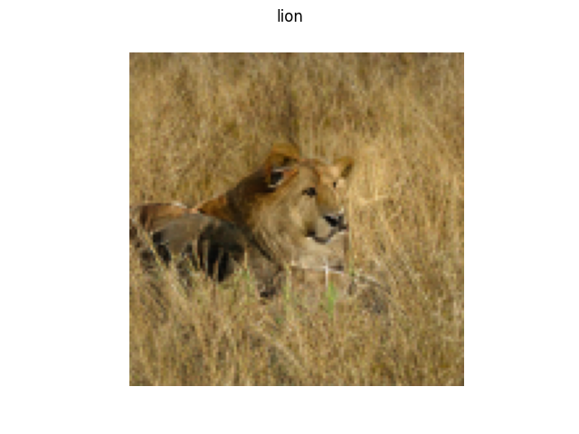

# BigGAN deep

Tensorflow 2 implementation of [BigGAN deep](https://arxiv.org/pdf/1809.11096.pdf).

This implementation is a Tensorflow 2 adaptation of the [Huggingface PyTorch
implementation](https://github.com/huggingface/pytorch-pretrained-BigGAN).

ImageNet labels have been taken from the [imagenet-simple-labels
repository](https://github.com/anishathalye/imagenet-simple-labels).

| Lion | Polar Bear |
| :---:| :---: |
|  |  |


## Usage

The BigGAN can be loaded in 3 configurations: 128, 256 or 512 pixels. The models
are loaded using the `BigGAN.from_pretrained` method.

If no TF weights are present, under `biggan-deep-XXX`, the code will build the
model, get the weights from both TFHub and the PyTorch model (necessary to
extract BatchNormalization statistics). Once the model has been built once, the
TF weights will be saved locally.

Sampling can be done by passing a list of labels to the `sample_with_labels`
method.

```python
from biggan import BigGAN

model = BigGAN.from_pretrained("biggan-deep-128")
images = model.sample_with_labels(["lion", "tiger", "polar bear"])
```
