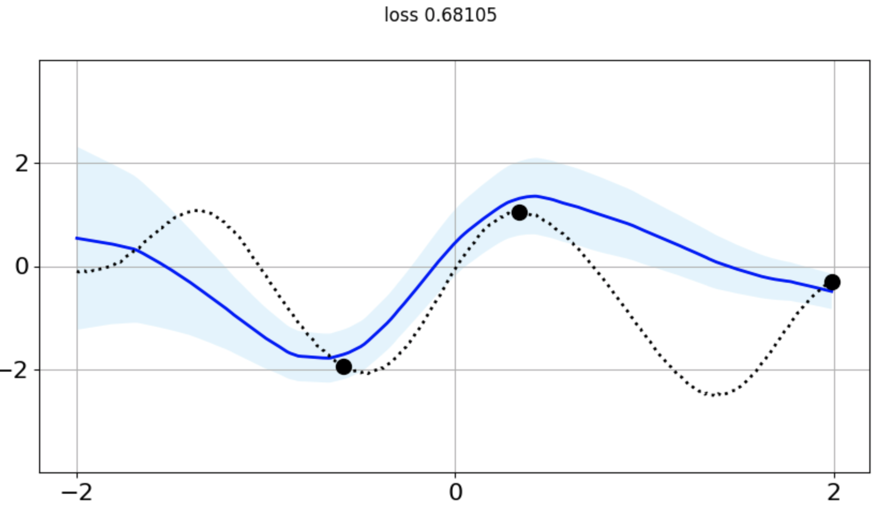
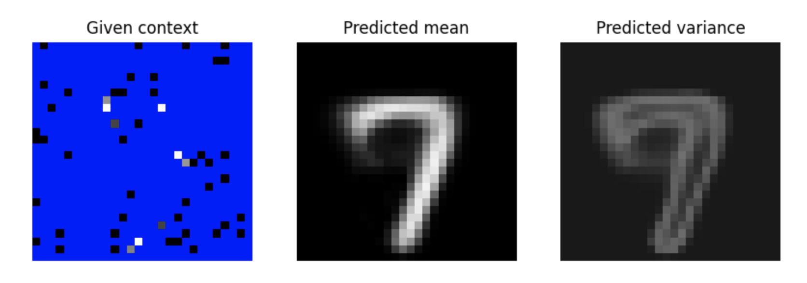

# Conditional Neural Processes

Tensorflow 2 generic implementation of the [conditional neural processes (CNP)](https://arxiv.org/pdf/1807.01613.pdf).


<div align="center">
    
    
</div>

## Usage

To train the model on a regressive task or on MNIST

```shell
python train.py -t mnist
python train.py -r regression
```

On MNIST, the CNP is trained with a context size varying between 10 and 100 points.

On the regression task, the CNP is trained with a context size varying between 2 and 10 points.

To see all training options use :
```shell
python train.py -h
```

To see visualizations use
```shell
tensorboard --logdir ./logs
```